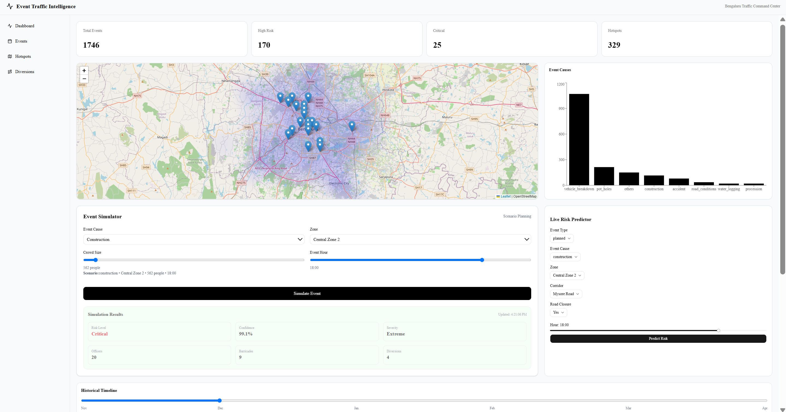
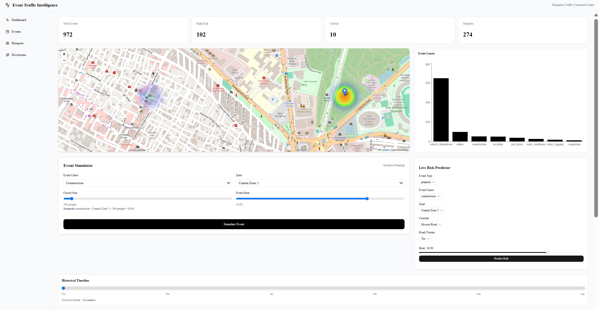
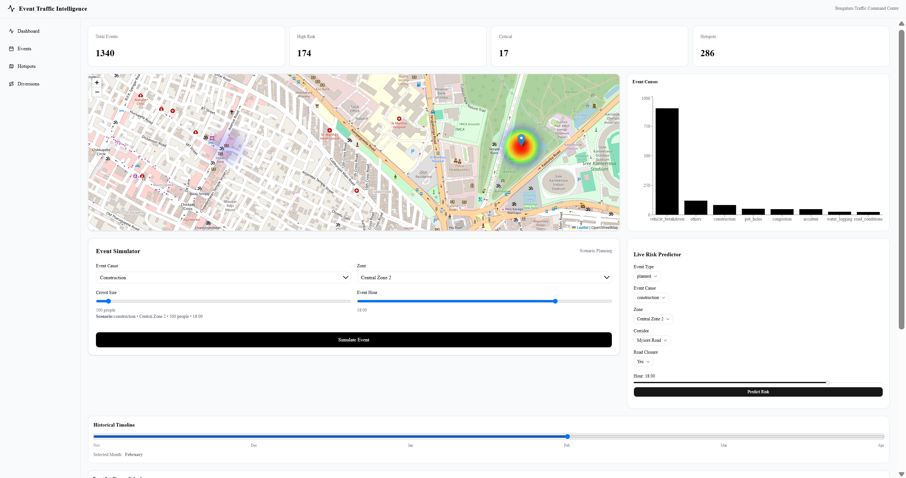
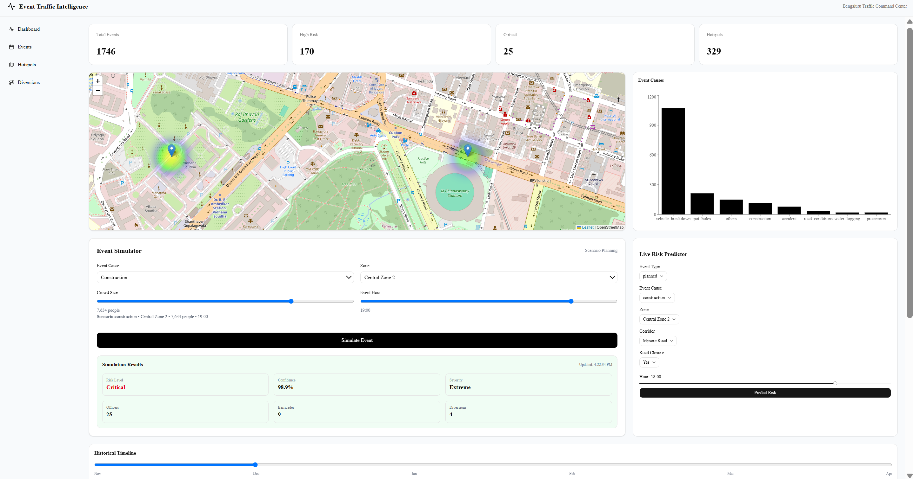
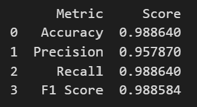
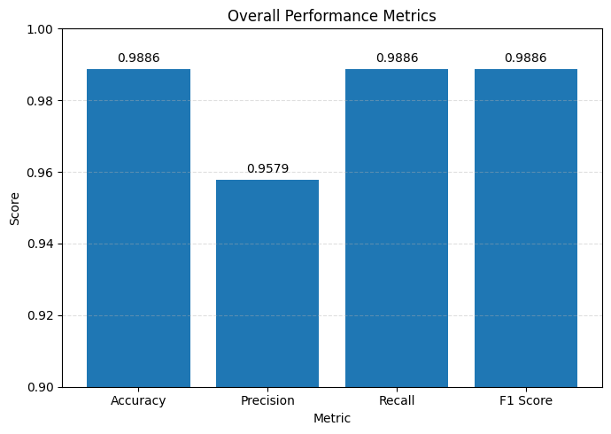
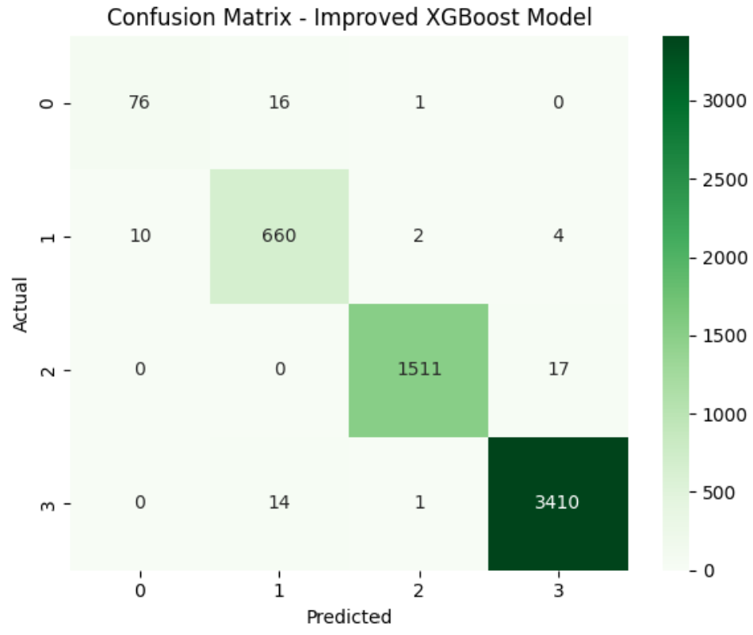
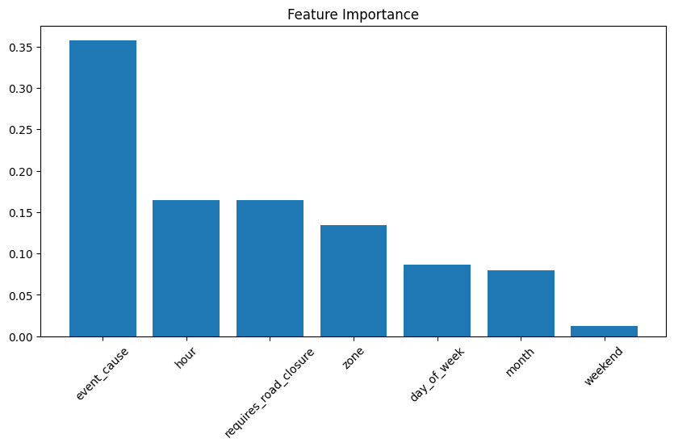
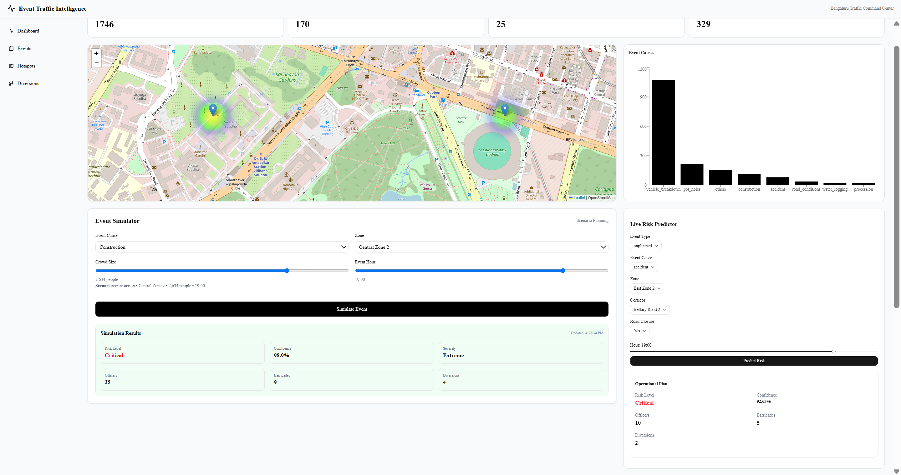
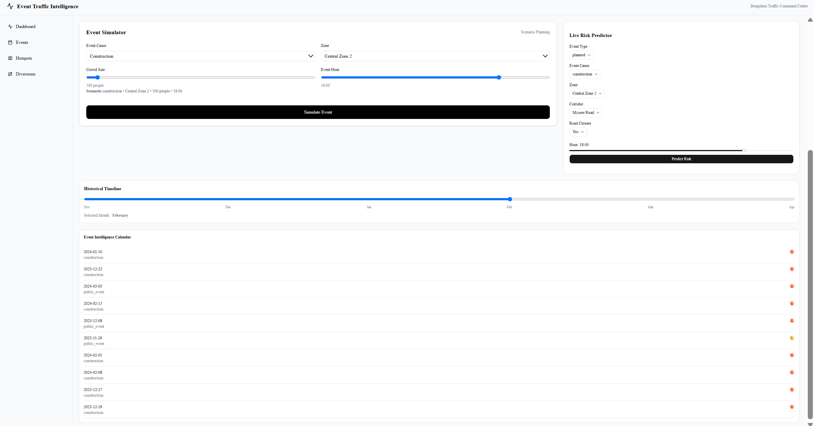

#  TEAM STARK
## DEMO VIDEO: https://drive.google.com/file/d/1QaXPjZMftbiOaQnoLP5bvXF6l40BM5Dn/view?usp=sharing

# 🚦 Event Traffic Intelligence Dashboard

## 📌 Overview

Event Traffic Intelligence Dashboard is an AI-powered traffic analytics and risk prediction platform designed to analyze road events, identify traffic hotspots, predict traffic risk levels, recommend resource allocation, and provide interactive traffic intelligence visualizations.

The system combines **Machine Learning**, **Geospatial Analytics**, **Traffic Event Analysis**, and **Interactive Dashboards** to help authorities make data-driven decisions regarding traffic management and incident response.

---

# 📊 Results & Performance

## 🖥️ Interactive Dashboard

The Event Traffic Intelligence Dashboard provides an intuitive interface for monitoring traffic events, analyzing congestion hotspots, predicting traffic risks, and visualizing traffic trends. Users can interact with multiple charts, maps, and analytics to gain actionable insights.

<p align="center">
  
</p>

---

## 🗺️ Traffic Heatmap

The heatmap highlights regions with high traffic event density across Bengaluru. This visualization helps identify congestion-prone areas and supports efficient resource planning.

<p align="center">
  
  
</p>

**Key Highlights**

- Visualizes traffic hotspots geographically.
- Interactive monthly filtering.
- Supports location-based traffic analysis.


---

## 🚔 Resource Recommendation

Based on the predicted risk level, the system recommends the required operational resources for efficient traffic management.

<p align="center">
  
</p>

**Generated Recommendations**

- Traffic Officers
- Barricades
- Diversions
- Traffic Management Strategy

---

# 📈 Model Evaluation

The XGBoost classifier was evaluated using standard classification metrics. The model achieved high performance while maintaining balanced predictions across all traffic risk categories.

## Performance Metrics


<p align="center">
  
  
</p>

**Performance Analysis**

- High prediction accuracy across traffic events.
- Excellent recall minimizes missed high-risk incidents.
- Strong F1-score indicates balanced classification performance.

---

## 📉 Confusion Matrix

The confusion matrix illustrates the model's prediction performance for each traffic risk category. Most predictions lie on the main diagonal, indicating accurate classification with very few misclassifications.

<p align="center">
  
</p>

**Observations**

- High classification accuracy across all four classes.
- Minimal confusion between neighboring risk levels.
- Consistent model performance on unseen data.

---
## 📉 Feature Importance

<p align="center">
  
</p>

---


## 🎯 Event Simulator

The simulator enables users to create hypothetical traffic scenarios and instantly obtain predictions and resource recommendations.

<p align="center">
  
</p>

**Simulation Output**

- Predicted Risk Level
- Prediction Confidence
- Resource Allocation
- Recommended Diversions

---
## 🎯 Historical Timeline

<p align="center">
  
</p>

---

# ✅ Conclusion

The Event Traffic Intelligence Dashboard successfully integrates **Machine Learning**, **Geospatial Analytics**, and **Interactive Visualization** into a unified decision-support platform. The system assists traffic authorities in identifying congestion hotspots, predicting traffic risks, and recommending optimal resource allocation. Its modular architecture supports future integration with real-time traffic feeds, GPS systems, and weather information, making it a scalable solution for smart city traffic management.

# ✨ Features

## 📊 Traffic Analytics Dashboard

* Interactive traffic heatmap
* Event hotspot visualization
* Historical event timeline
* Monthly traffic analysis
* Event distribution analytics
* Traffic trend exploration

---

## 🤖 Risk Prediction Engine

Predicts traffic risk levels:

* Low
* Medium
* High
* Critical

Based on:

* Event Type
* Event Cause
* Road Closure Requirement
* Time of Day
* Day of Week
* Month
* Zone
* Corridor
* Junction
* Event Density
* Location Coordinates

---

## 🚔 Resource Recommendation System

Provides recommendations for:

* Traffic Officers
* Barricades
* Diversions

Based on:

* Event Cause
* Predicted Risk Level
* Crowd Size
* Traffic Conditions
* Peak Hours

---

## 🧪 Event Simulator

Allows users to simulate hypothetical traffic scenarios and instantly obtain:

* Predicted Risk Level
* Confidence Score
* Recommended Officers
* Required Barricades
* Diversions Needed

---

## 🗺️ Interactive Mapping

Built using:

* Leaflet
* OpenStreetMap

Features:

* Event Hotspots
* Heatmap Visualization
* Location Intelligence
* Dynamic Monthly Filtering

---

## 📅 Event Calendar

Provides event history and traffic event tracking.

---

# 🛠️ Tech Stack

## Frontend

* Next.js 15
* React
* TypeScript
* Tailwind CSS
* ShadCN UI
* Recharts
* Leaflet

## Backend

* FastAPI
* Python
* Pandas
* NumPy
* Joblib

## Machine Learning

* XGBoost
* Scikit-Learn
* Label Encoding
* Feature Engineering

## Deployment

* Frontend → Vercel
* Backend → Render
* Version Control → GitHub

---

# 📂 Project Structure

```text
Event-Traffic-Intelligence-Dashboard/

├── backend/
│   ├── app/
│   ├── ml/
│   │   ├── saved_models/
│   │   └── encoders/
│   └── requirements.txt
│
├── frontend/
│   ├── app/
│   ├── components/
│   ├── lib/
│   └── public/
│
├── data/
├── docs/
├── notebooks/
└── README.md
```

---

# 📈 Dataset Overview

### Total Events

```text
8173
```

### Event Types

| Event Type | Count |
| ---------- | ----: |
| Unplanned  |  7706 |
| Planned    |   467 |

---

### Risk Distribution

| Risk Level | Count |
| ---------- | ----: |
| Medium     |  4892 |
| Low        |  2182 |
| High       |   966 |
| Critical   |   133 |

---

### Major Event Causes

* Vehicle Breakdown
* Construction
* Accident
* Water Logging
* Public Event
* Procession
* Protest
* Tree Fall
* Congestion
* Road Conditions

---

### Geographic Coverage

#### Bengaluru Traffic Network

Zones:

* Central Zone 1
* Central Zone 2
* East Zone 1
* East Zone 2
* North Zone 1
* North Zone 2
* South Zone 1
* South Zone 2
* West Zone 1
* West Zone 2

---

# 🧠 Machine Learning Pipeline

## Data Processing

* Missing Value Handling
* Feature Engineering
* Date-Time Extraction
* Geospatial Aggregation
* Risk Scoring

---

## Features Used

```text
event_type
event_cause
requires_road_closure
hour
day_of_week
month
weekend
zone
corridor
junction
latitude
longitude
event_density
```

---

## Model

### XGBoost Classifier

Target Variable:

```text
risk_level
```

Classes:

```text
Low
Medium
High
Critical
```

---

## Saved Artifacts

```text
risk_model_v2.pkl
target_encoder_v2.pkl
feature_encoders_v2.pkl
```

---

# 🔌 API Endpoints

| Method | Endpoint             |
| ------ | -------------------- |
| GET    | /health              |
| GET    | /event-stats         |
| GET    | /hotspots            |
| GET    | /heatmap             |
| GET    | /event-causes        |
| GET    | /calendar            |
| GET    | /resource-plan       |
| GET    | /recommend-resources |
| POST   | /predict-risk        |

---

## Sample Prediction Request

```json
{
  "event_type": "planned",
  "event_cause": "construction",
  "requires_road_closure": true,
  "hour": 18,
  "day_of_week": 5,
  "month": 8,
  "weekend": 1,
  "zone": "Central Zone 2",
  "corridor": "Mysore Road",
  "junction": "MekhriCircle",
  "latitude": 12.98,
  "longitude": 77.59,
  "event_density": 120
}
```

---

# 🚀 Local Setup

## 1️⃣ Clone Repository

```bash
git clone <repository-url>

cd event-traffic-intelligence
```

---

## 2️⃣ Backend Setup

```bash
cd backend

python -m venv venv

venv\Scripts\activate

pip install -r requirements.txt

uvicorn app.main:app --reload
```

### Backend URL

```text
http://127.0.0.1:8000
```

### Swagger Documentation

```text
http://127.0.0.1:8000/docs
```

---

## 3️⃣ Frontend Setup

```bash
cd frontend

npm install

npm run dev
```

### Frontend URL

```text
http://localhost:3000
```

---

# ⚙️ Environment Variables

Create:

```text
frontend/.env.local
```

Add:

```env
NEXT_PUBLIC_API_URL=https://your-api.onrender.com
```

Example:

```env
NEXT_PUBLIC_API_URL=https://event-traffic-api.onrender.com
```

---

# 🌐 Deployment

## Backend Deployment (Render)

### Build Command

```bash
pip install -r requirements.txt
```

### Start Command

```bash
uvicorn app.main:app --host 0.0.0.0 --port $PORT
```

---

## Frontend Deployment (Vercel)

### Root Directory

```text
frontend
```

### Environment Variable

```env
NEXT_PUBLIC_API_URL=https://your-api.onrender.com
```

---

# 🔮 Future Enhancements

* Real-Time Traffic Monitoring
* Live GPS Integration
* Weather-Aware Predictions
* Dynamic Route Optimization
* Advanced Traffic Forecasting
* AI-Powered Traffic Recommendations
* Mobile Application Support

---

# 👨‍💻 Author
**Team Stark**

VIT Bhopal University
